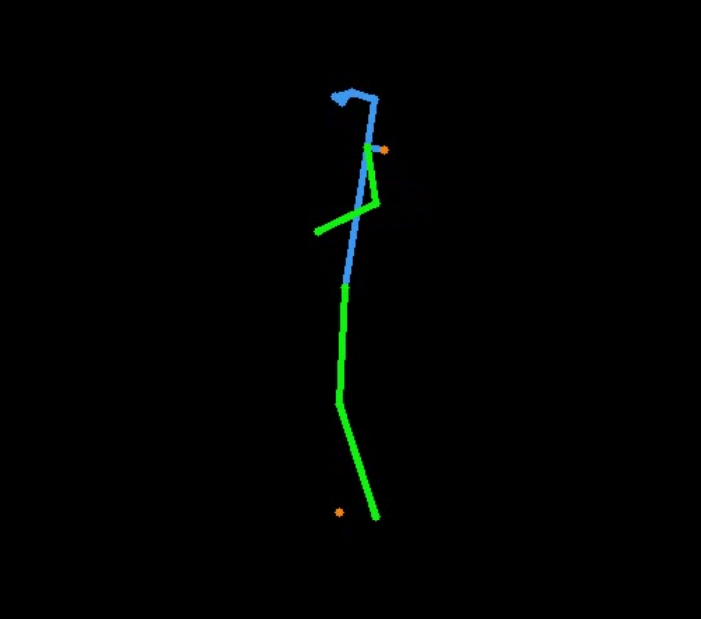

# Text2Video Project


## Table of contents

- [Project Descriptions](#project-descriptions)
- [Install](#install)
- [Feautures](#features)
- [How to use](#how-to-use)
- [Test examples](#test-examples)
- [Contact](#contact)


## Project Descriptions

Dự án được thực hiện nhằm mục đích cho phép tạo sinh video ngắn từ một video tham chiếu và text (prompt) mô tả các thuộc tính đầu ra mà người dùng mong muốn. Trong đó:
+ ``Video tham chiếu``: dùng để trích xuất pose nhằm làm điều kiện để tạo sinh chuyển đông chính xác
+ ``Text``: Mô tả các đặc trưng mong muốn đầu ra 

## Features

- [x] Hỗ trợ ngôn ngữ tiếng Việt
- [ ] Tối ưu cho video dài trên 1 phút
- [ ] Cải thiện độ chính xác của thuật toán ước tính human pose

## Install
### Back-end
- Về cấu hình yêu cầu:
    - Tối thiểu GPU 16G VRAM, khuyến nghị 24GB VRAM
    - RAM: 12GB
    
- Cài đặt các thư viện cần thiết
    ```bash
    cd text2video
    pip install -r requirements.txt
    git lfs install
    pip install -U openmim
    mim install mmcv==2.0.0
    cd backend
    sh download_module.sh
    ```
- Note: Do dự án dùng generative model nên dung lượng của module tải xuống khá nặng ``(9GB)``. Trong module tải xuống gồm:
    - Translate model
    - Video Diffusion model
    - Pose estimate model

### Front-end

<a href="https://github.com/genkerizer/text2video/blob/main/frontend/README.md">Xem chi tiết</a>

## How to use

- runing backbend
    ```bash
    python3 manage.py
    ```

    Sau khi chạy thành công API ta được
    ```text
    * Serving Flask app 'manage'
    * Debug mode: off
    * Running on http://127.0.0.1:5000
    Press CTRL+C to quit
    * Running on http://ddd2-34-16-128-235.ngrok.io
    * Traffic stats available on http://127.0.0.1:4040
    ```
- Thông tin địa chỉ ngrok dùng để kết nối front-end và back-end, ví dụ ``http://ddd2-34-16-128-235.ngrok.io`` <a href="https://github.com/genkerizer/text2video/blob/main/frontend/README.md">Xem chi tiết</a>


## Test examples

### Một số kết quả test

<table class="center">
<tr>
  <td></td>
  <td></td>
  <td></td>

</tr>
<tr>

</tr>
<tr>
  <td width=25% style="text-align:center;">Trump ở trên biển</td>
  <td width=25% style="text-align:center;">Gấu trúc trên mặt nước</td>
  <td width=25% style="text-align:center;">Cô gái nhảy trên núi</td>
</tr>
</table>

### Một số vấn đề

Việc phát hiện pose nhiều khi không đủ số lượng keypoint, điều này gây ảnh hưởng đến kết quả

<table class="center">
<tr>
  <td></td>
  <td></td>
  <td></td>
  <td></td>

</tr>
<tr>

</tr>
<tr>
  <td width=25% style="text-align:center;">Mất tay phải</td>
  <td width=25% style="text-align:center;">Mất hoàn toán các keypoint"</td>
  <td width=25% style="text-align:center;">Tình trạng xoay nghiêng người làm mất keypoint</td>
  <td width=25% style="text-align:center;">Mất chân và tay</td>
</tr>
</table>

Dẫn đến một số kết quả khá kém, thậm chí, kết quả không thể hiện ra được hình người vốn có, đây cũng là vấn đề lớn nhất của dự án cần phải giải quyết
<table class="center">
<tr>
  <td></td>
  <td></td>

</tr>
<tr>

</tr>
<tr>
  <td width=25% style="text-align:center;">Cô gái nhảy múa trên cát</td>
  <td width=25% style="text-align:center;">Cô gái ở trên ngọn núi"</td>
</tr>
</table>

## Reference
- [MMPOSE](https://github.com/open-mmlab/mmpose)
- [Follow-your-pose](https://github.com/mayuelala/FollowYourPose)
- [Envit5](https://huggingface.co/VietAI/envit5-translation)

## Contact
- [Nguyễn Y Hợp](mailto:22c15006@student.hcmus.edu.vn)
- [Cao Cảnh Linh](mailto:22c15034@student.hcmus.edu.vn)


